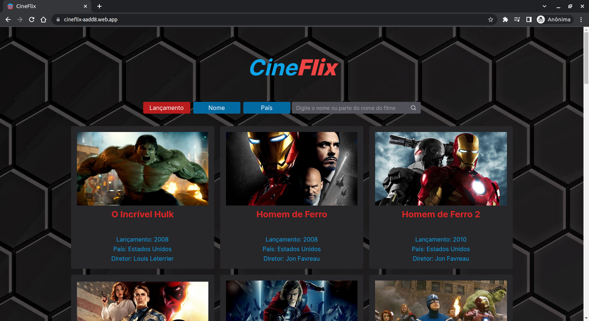

<h1 align="center">CineFlix
	<br/>
	
	<br/>
</h1>

[](https://github.com/LeoMSSilva)
[](https://github.com/LeoMSSilva)
[](#)
[](https://github.com/LeoMSSilva/cineflix/stargazers)
[](https://github.com/LeoMSSilva/cineflix/network/members)
[](https://github.com/LeoMSSilva/cineflix/graphs/contributors)

---

# :pushpin: Table of Contents

- :house: [About](#house-about)
- :dart: [Installation](#dart-installation)
  - :gear: [Install dependencies](#hammer_and_wrench-install-dependencies)
  - :rocket: [Getting started](#rocket-getting-started)
- :computer: [Techs](#computer-techs)
- :bust_in_silhouette: [Author](#bust_in_silhouette-author)
- :handshake: [Contributing](#handshake-contributing)
- :scroll: [License](#scroll-license)

---

# :house: About

This project was developed in **typescript** language, using **reactJs** framework.

I used **vite** during development to speed up the creation of static pages for real-time viewing.

I used **javascript** and **json** languages ​​as secondary languages, just for the configuration files.

I used the **commitlint**, **@commitlint/config-conventional**, **commitizen** and **cz-conventional-changelog** libraries to keep the patterns in the commits, the **prettier**, **@trivago/prettier-plugin-sort-imports** and **eslint** (_config_: **prettier**, **react**, **react-hooks**, **tailwindcss**; _plugins_: **prettier**, **@typescript-eslint**, **react**, **react-hooks**, **tailwindcss**; _parser_: **@typescript-eslint**) libraries to maintain formatting standards, also helping to remove errors in the code, and the **husky**, **lint-staged** libraries to automate tasks before committing new code to ensure that the code is formatted and without errors.

I used **phosphor** for icons styled.

I used **tailwindcss**, **postcss** and **autoprefixer** to style css with component accessibility.

This project is about a website that lists movies.

You can access the project through the link published at **[firebase](https://cineflix-aadd8.web.app)**.

---

# :dart: Installation

**First you need to install:**

- [Node.js](https://pt-br.nodejs.org) (required)
- [Pnpm](https://pnpm.io/pt/) (optional)

  **Then in order, clone the project.**

By HTTPS, running this command:

```bash
  git clone https://github.com/LeoMSSilva/cineflix.git
```

Or by ssh, running this command:

```bash
  git clone git@github.com:LeoMSSilva/cineflix.git
```

SSH is a secure protocol, but you need to register a key ssh in your github before.

## :hammer_and_wrench: Install dependencies

```bash
  pnpm install
```

## :rocket: Getting Started

```bash
  pnpm run dev
```

---

# :computer: Techs

- Commitlint
  - @commitlint/config-conventional
- Commitizen
  - cz-conventional-changelog
- Eslint
  - config:
    - prettier
    - react",
    - react/jsx-runtime",
    - react-hooks",
    - tailwindcss"
  - plugins:
    - prettier
    - @typescript-eslint
    - react
    - react-hooks
    - tailwindcss
  - parser:
    - @typescript-eslint
- Javascript
- Husky
- Lint-staged
- Phosphor
- Prettier
  - @trivago/prettier-plugin-sort-imports
- ReactJs
- TailwindCss
- Typescript
- Vite

---

# :bust_in_silhouette: Author

**LeoMSSilva**

- Github: [@LeoMSSilva](https://github.com/LeoMSSilva)
- LinkedIn: [@LeoMSSilva](https://linkedin.com/in/LeoMSSilva)

---

# :handshake: Contributing

Contributions, issues and feature requests are welcome! Feel free to **file a new issue** on the [cineflix](https://github.com/LeoMSSilva/cineflix/issues) repository. If you already found a solution to your problem, **I would love to review your pull request**!

---

# :scroll: License

Copyright :copyright: 2023 [LeoMSSilva](https://github.com/LeoMSSilva).
<br/>
This project is [MIT](https://github.com/LeoMSSilva/cineflix/blob/main/LICENSE) licensed.

---
